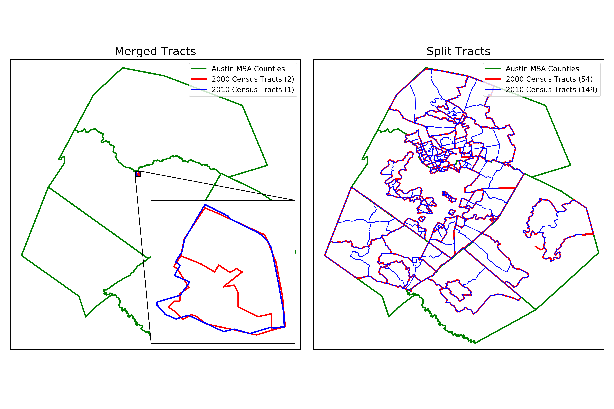

# Clustering Neighborhood Change in Austin
### Data Wrangling

## The Source:
The United States Census Bureau (USCB) provides easy access to all census related datasets through their [American FactFinder](https://factfinder.census.gov/) portal. They offer community summaries, guided data retrieval, and advanced searching capabilities. For my purposes, the advanced search was used to identify and acquire the necessary datasets at the census tract level. For this study I acquired datasets which contained household income, home value, rental price, education attained, racial makeup, and employment rate for the years 2000, and 2009-2016. The geography will be limited to the metropolitan statistical area (MSA) for Austin which includes Bastrop, Caldwell, Hays, Travis, and Williamson Counties.

Census tracts are designed to be roughly equivalent to neighborhoods in that they generally have a population between 2,500 and 8,000 people. Geographic reference maps (shapefiles) of the 2000 and 2010 census tracts were obtained from the USCB’s [Maps & Data](https://www.census.gov/geo/maps-data/maps/reference.html) site. While census tracts are considered semi-permanent, they do change over time. To relate previous census tracts configurations to the most current census tracts, [relationship files](https://www.census.gov/geo/maps-data/data/relationship.html) must be utilized.

Finally, to accurately compare income and cost of living values over time, the monetary features were adjusted to 2016 prices. For this, I used the Bureau of Labor Statistics’ (BLS) [Consumer Price Index Research Series](https://www.census.gov/topics/income-poverty/income/guidance/current-vs-constant-dollars.html) (CPI_U_RS).

## The Munging:
#### Dropping and Renaming Columns
The raw census data from USCB contained many fields that weren’t needed for the clustering analysis, so they were dropped at the reading stage. These fields typically contained data that were grouped at different demographic levels other than for the entire population (e.g. income by sex, education by race, unemployment by age, etc.) as well as margins of error on estimates. Additionally, the column headings were in a descriptive form and were changed to a more succinct, compact version. For example, in the household income table, the field Estimate; Total: - $10,000 to $14,999 was changed to [10k-15k) where the interval is inclusive on the low end and exclusive on the high end.

#### Relating Census Tracts
Directly after reading the data, the relationship files were used to convert census tracts from the 2000 decennial census (years 2000 and 2009) to the 2010 decennial census (years 2010-2016). This was done using a population percentage change from census tracts that either merged multiple tracts into single tract or split a single tract into multiple tracts between 2000 and 2010. I only considered census tract changes which had a >5% change in population.

The figure above shows only the census tracts that changed more than 5% in total population between the decennial censuses. The 2000 census contained 256 tracts while the 2010 census contained 350.

#### Binned Features
The binned features did not share the same columns throughout the years; some years had more bins and some had less. Bins that were common to every year were ultimately used, and years which had more bins were aggregated to match.

###### Interval
The household income, home value, and rental price datasets contained monetary values that were partitioned into somewhat even bins. These binned interval features contained totals and a count of the number of occurrences for each bin (much like a histogram). The bin counts were divided by the total for that tract to get a percentage in each bin. This allowed for better comparison of tracts with varying populations.

###### Ordinal
The education attained table was ordinally binned by highest level of education completed, ranging from less than high school to graduate (which included masters, doctorate, and professional degrees). As with the binned interval features, education attained was converted to percentages in each bin for each tract for better comparison.

###### Creating Indexes
To reduce the binned data down to a single number for clustering, an index was created for each binned variable. For the interval variables, the percentage in each bin was multiplied by the middle point for that bin’s interval range. This required making a conservative assumption of the middle point for the uppermost bin (e.g. for income >200k). These can roughly be thought about as the median value for a distribution which is represented by the bins. The index for education attained was created similarly, except that a simple range of 1 to 8 was used as a multiplying factor because of the ordinal nature of the bins.

#### Percentages
The employed feature is the percentage of the eligible workforce that was employed at the time of the census. The racial demographic feature was simplified down to a single percentage which represents the percentage of the population that is white for each tract. This can be thought of as an indicator for diversity.

#### Adjusting for Inflation
The CPI_U_RS data was used to calculate inflation factors for each of the years in relation to 2016. The monetary indexes were then multiplied by this inflation factor so they could be more reliably compared.

## The Cleaning:
To ensure a fair and robust clustering analysis, the data was checked for missing values (in this case zeros). A total of 10 tracts were found to have missing data. Upon investigating the census tracts with missing values using various mapping tools, 3 were found to have missing values that could be imputed while the remaining 7 tracts could not and were excluded.

#### Imputing Rent Index
There are three census tracts which had zero values for rent index (6 data points total). This was caused by the simple fact that there were no properties for rent at the time of the census. These rent index values were imputed by linear interpolation between the previous year that had a non-zero rent index and the next year that had a non-zero rent index.

#### Dropping Special Tracts
The remaining tracts were special cases that did not fit into the framework for this problem. These were tracts that had no residential households and artificial population demographics. The following list summarizes each census tract that was dropped from the dataset.

|Census Tract|Description                              |
|------------|-----------------------------------------|
|48453000203 |Austin State Hospital                    |
|            |Austin School for the Blind              |
|            |Central Texas Rehabilitation Center      |
|            |Texas Department of State Health Services|
|48453000601 |University of Texas                      |
|            |Texas Capitol Complex                    |
|48453001606 |Austin State Supported Living Center     |
|48453001753 |Gateway Shopping Center                  |
|48453001849 |J.J. Pickle Research Laboratory          |
|            |The Domain Shopping Center               |
|            |Industrial Complex                       |
|48453002319 |Travis County Correctional Complex       |
|48453980000 |Austin Bergstrom Airport                 |

## The Summary:
The data wrangling process that I used consisted of several steps. First the data source was identified and the raw data was acquired. Next, unused columns were dropped and used columns were renamed in an intuitive way. Tracts from the 2000 census were converted to 2010 census tracts using relationship files. Binned features were then simplified into indexes so they could be represented with a single number for each tract. Single population demographics were converted to percentages and all monetary features were adjusted for inflation to 2016 prices. Rent index was imputed for three tracts while seven tracts that did not fit the framework of this study were dropped.

After the data wrangling process was complete, I was left with a clean dataset which consisted of six features and 343 observations. This would be my dataset moving forward through the exploratory data analysis and clustering phases.
